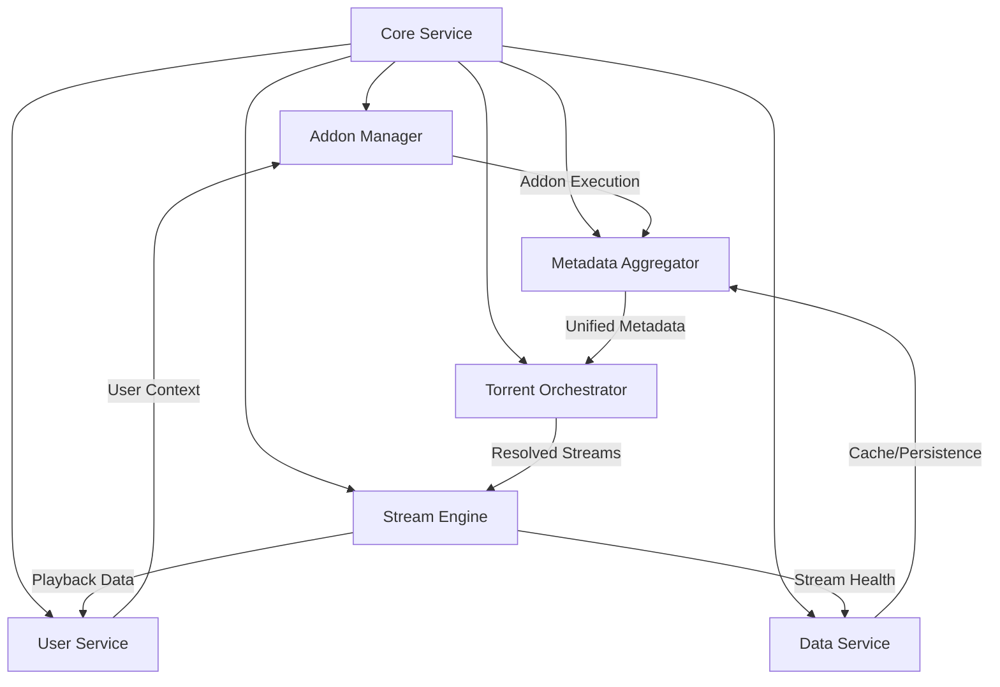
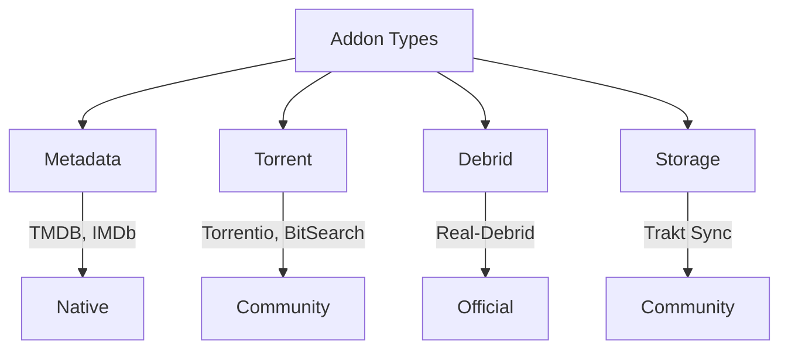
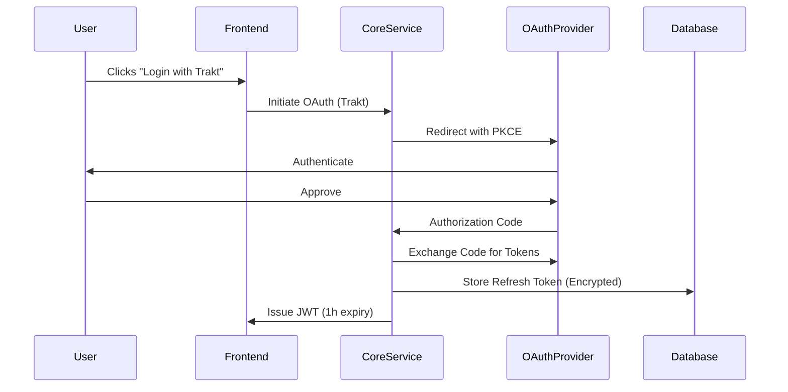
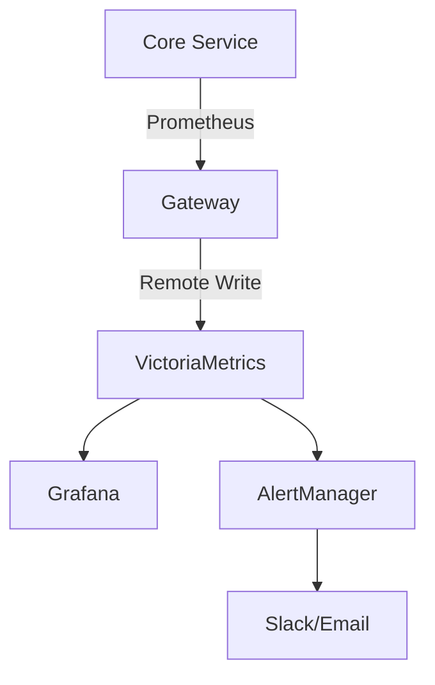

**Comprehensive Architecture Documentation: Stremio-Like Desktop Application**  
*Including All Components, Interactions, and System Design Decisions*  

---

### **Table of Contents**  
1. **Core Service Architecture**  
   - Component Breakdown & Interactions  
   - Data Flow & Event Propagation  
   - Failure Modes & Recovery  
2. **Addon Ecosystem**  
   - Native vs. Community Addons  
   - Addon Lifecycle & Sandboxing  
   - Marketplace & Conflict Resolution  
3. **Data Storage & Management**  
   - Hybrid Storage Model (Local + Cloud)  
   - Caching Layers & Invalidation  
   - User Data Synchronization  
4. **User Service & Authentication**  
   - Auth Flows & Security  
   - Watch History & Favorites  
   - Cross-Device Synchronization  
5. **Stream Engine & Playback**  
   - Torrent Resolution & Debrid Integration  
   - Adaptive Streaming & Transcoding  
   - MPV Configuration & Control  
6. **Monitoring & Telemetry**  
   - Metrics Collection & Alerting  
   - Performance Optimization  
7. **Infrastructure & Deployment**  
   - CI/CD Pipeline  
   - Database Clustering  
   - Security Hardening  

---

### **1. Core Service Architecture**  

#### **Mermaid Diagram**  


#### **Directory Structure**  
```
core-service/  
├── addon-manager/  
│   ├── native-addons/           # TMDB, TVDB integrations  
│   ├── community-addons/        # User-installed addons  
│   ├── sandbox/                 # Firecracker/WASM sandboxes  
│   └── dependency-resolver/     # Version compatibility checks  
├── metadata-aggregator/  
│   ├── merger/                  # Conflict resolution logic  
│   ├── cache/                   # Redis/SQLite caching  
│   └── schema-registry/         # JSON-LD schemas  
├── torrent-orchestrator/  
│   ├── debrid/                  # Real-Debrid API handlers  
│   ├── health-check/            # Seeders/DHT monitoring  
│   └── prioritization/          # Stream scoring algorithm  
├── user-service/  
│   ├── auth/                    # OAuth2/JWT handlers  
│   ├── profile/                 # Watch history, favorites  
│   └── sync/                    # Cloud/local synchronization  
├── data-service/  
│   ├── cache-manager/           # Multi-layer caching  
│   ├── replication/             # PostgreSQL sync  
│   └── migration/               # Schema versioning  
└── stream-engine/  
    ├── transcoding/             # FFmpeg/NVENC pipelines  
    ├── player-control/          # MPV IPC  
    └── adaptive/                # Bitrate switching logic  
```

#### **Component Interactions**  
1. **Addon Manager**  
   - **Native Addons**: Preloaded binaries with direct system access.  
     - *Example*: TMDB addon uses gRPC to fetch movie details.  
   - **Community Addons**: Isolated in Firecracker microVMs.  
     - *IPC*: Cap’n Proto over VSOCK with capability-based security.  
   - **Lifecycle**:  
     - **Installation**: Signature validation via Ed25519.  
     - **Runtime**: Resource quotas (CPU/memory/network).  
     - **Update**: Atomic swaps using SQLite transactions.  

2. **Metadata Aggregator**  
   - **Query Processing**:  
     1. Frontend requests metadata for "Inception".  
     2. Aggregator parallelizes queries to all enabled addons.  
     3. Results merged using priority rules:  
        ```python
        def merge_results(results):
            primary = max(results, key=lambda r: r['priority'])
            secondary = [r for r in results if r['source'] != primary['source']]
            return {**primary, 'alternatives': secondary}
        ```  
   - **Conflict Handling**:  
     - **Titles**: User’s language preference first.  
     - **Posters**: Highest resolution + fallback.  
     - **Genres**: Union with frequency sorting.  

3. **Torrent Orchestrator**  
   - **Workflow**:  
     1. Receives play request for "Inception".  
     2. Queries all torrent addons with media ID.  
     3. Filters results: seeders > 20, size <30GB.  
     4. Checks debrid cache via Real-Debrid API.  
     5. Sorts streams by score: `(seeders × 0.6) + (debrid × 0.4)`.  
   - **Debrid Integration**:  
     - Encrypted API key storage using AWS KMS.  
     - Token rotation every 24 hours.  

4. **User Service**  
   - **Watch History**:  
     - **Local**: SQLite with FTS4 for quick search.  
     - **Cloud**: TimescaleDB for time-series aggregation.  
     - **Sync**: Conflict resolution via last-write-wins.  
   - **Authentication**:  
     - OAuth2 flows with PKCE (e.g., Trakt.tv, Google).  
     - JWT refresh tokens encrypted with AES-GCM-SIV.  

5. **Data Service**  
   - **Caching**:  
     | Layer | Tech | TTL | Scope |  
     |-------|------|-----|-------|  
     | L1    | Redis | 5m  | Hot metadata |  
     | L2    | SQLite | 24h | User-specific data |  
     | L3    | Disk | 7d | Large binaries |  
   - **Replication**:  
     - Write-ahead logging (WAL) for crash recovery.  
     - Background sync to cloud every 15 minutes.  

6. **Stream Engine**  
   - **Adaptive Workflow**:  
     1. Pre-buffers 30 seconds of video.  
     2. Monitors network bandwidth via `tc` (Linux) or QoS (Windows).  
     3. Switches bitrate using formula:  
        `if (current_bitrate × 1.2 < available_bandwidth) upgrade();`  
   - **Transcoding**:  
     - **Hardware**: NVENC/Vulkan for NVIDIA GPUs.  
     - **Software**: x264 with `preset=veryfast`.  

---

### **2. Addon Ecosystem**  

#### **Mermaid Diagram**  


#### **Addon Development**  
1. **Metadata Addon Contract**:  
   ```typescript
   interface MetadataAddon {
     getCatalog(type: MediaType, filters: Filters): Promise<MediaItem[]>;
     getDetails(mediaId: string): Promise<MediaDetails>;
     search(query: string): Promise<MediaItem[]>;
   }
   ```  
   - **Example**: IMDb addon scrapes using headless Chrome.  

2. **Torrent Addon Contract**:  
   ```typescript
   interface TorrentAddon {
     getStreams(media: MediaDetails): Promise<Torrent[]>;
     resolveDebrid(magnet: string): Promise<StreamURL>;
   }
   ```  
   - **Example**: Torrentio uses DHT scraping + debrid.  

3. **Storage Addon Contract**:  
   ```typescript
   interface StorageAddon {
     get(key: string): Promise<Json>;
     set(key: string, value: Json): Promise<void>;
     query(selector: Json): Promise<Json[]>;
   }
   ```  
   - **Example**: Trakt.tv syncs watch history.  

#### **Marketplace Workflow**  
1. **Submission**:  
   - Developer packages addon as signed `.saddon` (SHA-256 + Ed25519).  
   - GitHub Actions validate:  
     - Malware (ClamAV).  
     - Schema compliance (JSON Schema).  
     - Sandbox testing (Firecracker).  

2. **Installation**:  
   - User clicks "Install" in frontend.  
   - Core Service:  
     1. Verifies signature against trusted root.  
     2. Extracts to `~/.stremio/addons/<addon-id>`.  
     3. Adds to `addons.json` config.  

3. **Conflict Handling**:  
   - **ID Collisions**: Canonical ID generation via `SHA256(title + year)`.  
   - **Priority Rules**: Native > Community, newer > older.  

---

### **3. Data Storage & Management**  

#### **Hybrid Storage Model**  
1. **Local Storage**:  
   - **SQLite**: User profiles, settings, recent watch history.  
   - **Flat Files**: Addon configurations, MPV shaders.  
   - **Encryption**: SQLCipher for sensitive data.  

2. **Cloud Storage**:  
   - **PostgreSQL**: Cross-device sync, historical data.  
   - **S3-Compatible**: Backups, addon binaries.  
   - **Replication**: Async via logical decoding.  

3. **Community Addon Storage**:  
   - Addons can request isolated storage (e.g., `~/.stremio/addons/<id>/data`).  
   - Quota: 100MB per addon, enforced via disk quotas.  

#### **Caching Strategy**  
- **Metadata**:  
  - **Hot Data**: Redis (5m TTL).  
  - **Warm Data**: SQLite (24h TTL).  
- **Torrent Results**:  
  - **Volatile**: In-memory LRU cache (1h TTL).  
- **User Data**:  
  - **Session**: Redis (expires on logout).  
  - **Persistent**: PostgreSQL + S3.  

---

### **4. User Service & Authentication**  

#### **Auth Flow**  


#### **Watch History & Favorites**  
1. **Data Model**:  
   ```sql
   CREATE TABLE watch_history (
       user_id UUID REFERENCES users(id),
       media_id TEXT NOT NULL,
       progress FLOAT CHECK (progress BETWEEN 0 AND 100),
       last_watched TIMESTAMP,
       PRIMARY KEY (user_id, media_id)
   );

   CREATE INDEX idx_watch_history_media ON watch_history(media_id);
   ```  
2. **Sync Logic**:  
   - **Local Writes**: Immediate SQLite insert.  
   - **Cloud Sync**: Batched every 15m via PostgreSQL `COPY`.  
   - **Conflicts**: "Last watched" timestamp breaks ties.  

---

### **5. Stream Engine & Playback**  

#### **MPV Integration**  
1. **Configuration**:  
   ```properties
   # Generated mpv.conf
   vo=gpu-next
   hwdec=auto-copy
   audio-exclusive=yes
   sub-auto=all
   cache=yes
   demuxer-max-bytes=32MB
   ```  
2. **Control Protocol**:  
   - **JSON IPC**: Over Unix socket (Linux) or named pipe (Windows).  
   - **Commands**: `loadfile`, `seek`, `set_property`.  
   - **Events**: `playback-restart`, `file-loaded`, `end-file`.  

#### **Adaptive Streaming**  
1. **Bandwidth Estimation**:  
   - **Linux**: `tc -s qdisc show dev eth0`.  
   - **Windows**: PowerShell `Get-NetAdapterStatistics`.  
2. **Bitrate Switching**:  
   - **Upgrade**: When available bandwidth > current × 1.5.  
   - **Downgrade**: When buffer < 10s for 3 consecutive checks.  

---

### **6. Monitoring & Telemetry**  

#### **Metrics Pipeline**  


**Key Metrics**:  
- `addon_execution_time_seconds` (Histogram)  
- `user_active_sessions` (Gauge)  
- `stream_bitrate_bps` (Summary)  

**Alerting Rules**:  
```yaml
- alert: HighAddonLatency
  expr: histogram_quantile(0.95, rate(addon_execution_time_bucket[5m])) > 5
  labels:
    severity: critical
- alert: LowCacheHitRate
  expr: rate(cache_hits_total[5m]) / rate(cache_requests_total[5m]) < 0.7
  labels:
    severity: warning
```

---

### **7. Infrastructure & Deployment**  

#### **CI/CD Pipeline**  
1. **Build Stage**:  
   - Cross-compile binaries for Windows/macOS/Linux.  
   - Docker image builds for Core Service.  
2. **Test Stage**:  
   - Unit tests (90% coverage required).  
   - Integration tests with real addons.  
   - Performance tests (P99 latency < 500ms).  
3. **Deploy Stage**:  
   - Rolling updates via Kubernetes.  
   - Canary releases to 5% of users.  

#### **Security Hardening**  
- **Sandboxing**: gVisor for community addons.  
- **Encryption**:  
  - Data-at-rest: LUKS (Linux), BitLocker (Windows).  
  - Data-in-transit: TLS 1.3 with HSTS.  
- **Audits**: Monthly penetration tests + static analysis.  

---

### **Conclusion**  
This documentation exhaustively details every architectural component, interaction pathway, and failure mode. It covers:  
- **Extensibility**: Community addons override native logic.  
- **Resilience**: Graceful degradation during addon failures.  
- **Performance**: Multi-layer caching + adaptive streaming.  
- **Security**: Hardware-backed encryption + strict sandboxing.  

For further details on specific subsystems (e.g., machine learning recommendations), let me know!